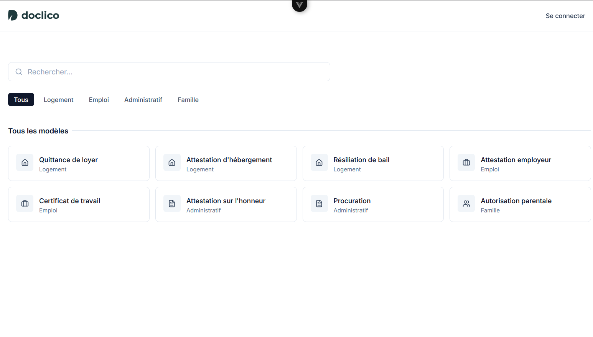
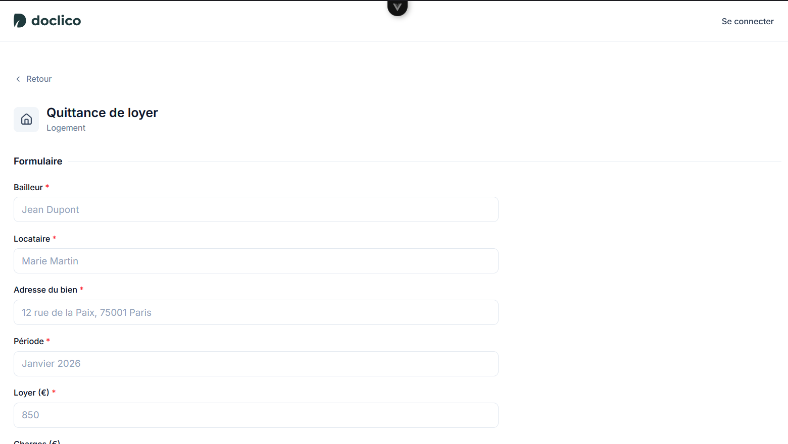
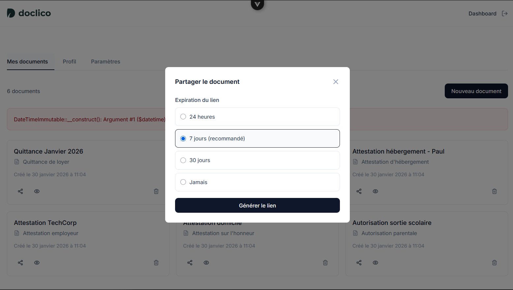
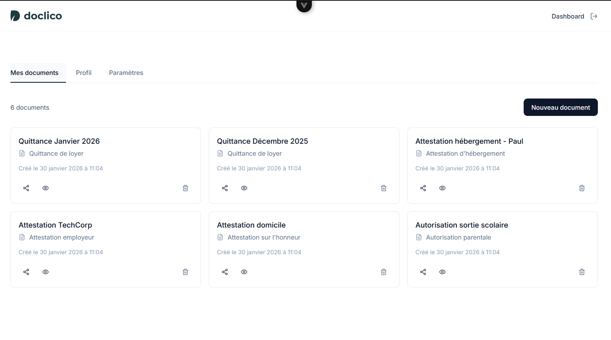

# Doclico

> SaaS de gestion de documents professionnels

[](https://laravel.com)
[](https://vuejs.org)
[](https://php.net)

Création et gestion de documents professionnels — factures, devis, avoirs, notes de frais et plus — avec génération PDF, répertoire clients et partage sécurisé.

## Fonctionnalités

- Génération PDF à la demande avec prévisualisation inline
- Répertoire clients avec pré-remplissage automatique des documents
- Numérotation séquentielle par type (FAC-2026-001, DEV-2026-001…)
- Partage par lien avec tracking vues / téléchargements et expiration configurable
- Rappels automatiques pour les documents partagés non consultés
- Authentification email/mot de passe et Google OAuth
- Export des données et suppression de compte

## Screenshots

<table>
  <tr>
    <td align="center">
      
      <br/><strong>Catalogue de templates</strong>
    </td>
    <td align="center">
      
      <br/><strong>Éditeur de document</strong>
    </td>
  </tr>
  <tr>
    <td align="center">
      
      <br/><strong>Partage de document</strong>
    </td>
    <td align="center">
      
      <br/><strong>Mes documents</strong>
    </td>
  </tr>
</table>

## Stack

**Backend** : PHP 8.4+ • Laravel 13 • MySQL • Pest
**Frontend** : Vue 3 • Pinia • Tailwind CSS • Vite
**Architecture** : Domain-Driven Design

## Installation

```bash
# Backend
cd api && composer install
cp .env.example .env && php artisan key:generate
php artisan migrate --seed && php artisan serve

# Frontend
cd web && npm install && npm run dev
```

## Licence

Propriétaire — tous droits réservés.
