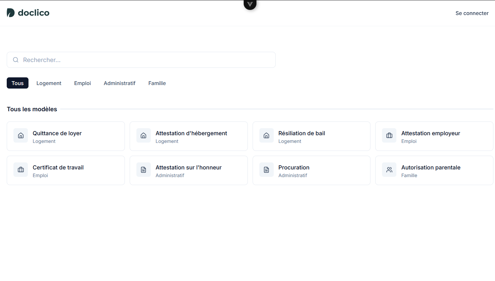
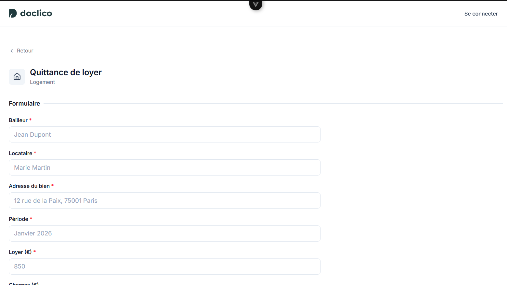
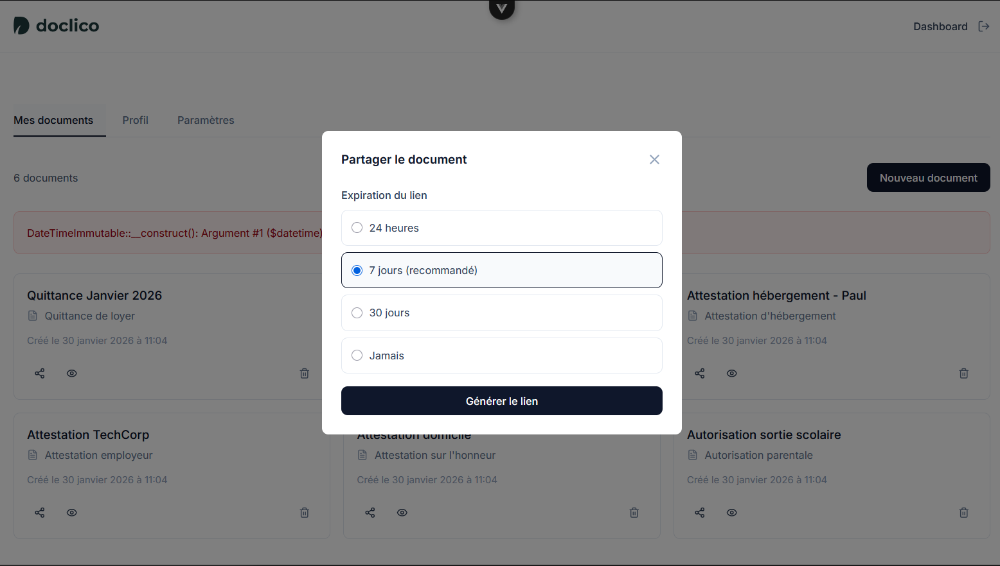
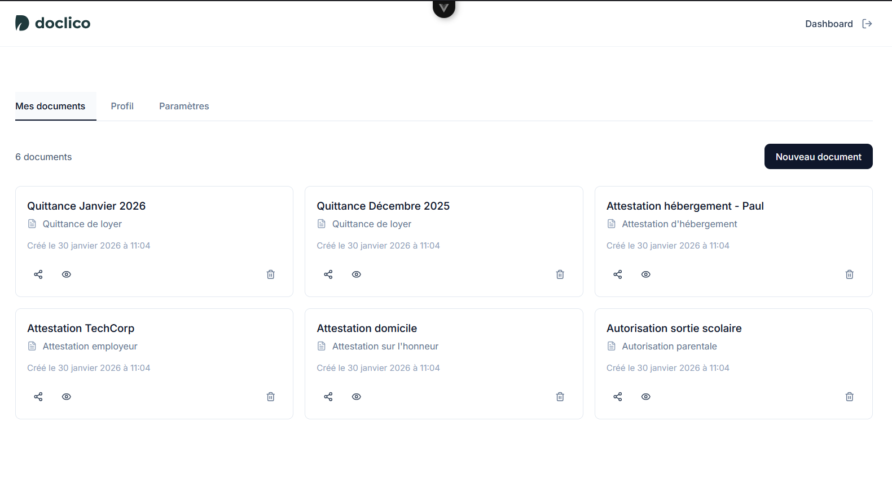

# Doclico

> SaaS de génération et de partage de documents professionnels — factures, devis, avoirs, notes de frais.

[](https://laravel.com)
[](https://vuejs.org)
[](https://php.net)

Création de documents à partir de templates, répertoire clients, génération PDF à la demande
et partage par lien sécurisé avec suivi des vues et relances automatiques.

**Stack** — API JSON Laravel 13 / PHP 8.4 · SPA Vue 3 (Composition API) · Pinia ·
Vue Router · Tailwind CSS · Vite · MySQL en production, SQLite en test · Pest.

> Projet conçu et développé seul, de la modélisation métier au déploiement. Ce README documente
> les décisions d'architecture les plus structurantes plutôt qu'une simple liste de fonctionnalités.

---

## Architecture en deux mots

Le back-end suit une **architecture hexagonale (ports & adapters)** en quatre couches. Le cœur
métier ne connaît pas Laravel : il dépend d'interfaces, et le framework vit aux frontières.

```
api/app/
├── Domain/          # PHP pur, zéro dépendance Laravel
│   ├── …/           # Entités (Document, Share, Client, User, Template)
│   ├── ValueObject/ # Identifiants typés (UUIDv7), Email, ShareToken
│   ├── …Interface   # Ports : contrats de persistance et de services
│   └── Exception/   # Exceptions métier explicites
├── Application/     # Cas d'usage — une classe = une opération execute()
│   ├── …Data        # DTO d'entrée
│   └── …Result      # DTO de sortie + Mapper dédié
├── Infrastructure/  # Adaptateurs : Eloquent, rendu PDF, mail, OAuth…
│   ├── Persistence/ # Repositories Eloquent + Mappers entité ↔ modèle
│   ├── Rendering/   # PdfRenderer, RendererFactory
│   └── Providers/   # DomainServiceProvider : liaison ports → implémentations
└── Http/            # Contrôleurs fins + Form Requests
```

Le principe directeur : **les dépendances pointent vers l'intérieur**. `Domain` et `Application`
ne dépendent que d'interfaces ; les implémentations concrètes (Eloquent, DomPDF, Socialite, mail)
sont injectées depuis `Infrastructure`. On peut changer de moteur de persistance ou de rendu sans
toucher à la logique métier.

---

## Décisions techniques notables

Ce sont les problèmes qui ont demandé le plus de réflexion.

### 1. Architecture hexagonale et inversion de dépendance

Chaque besoin externe (persistance, hachage de mot de passe, session, notification, rendu) est
défini comme un **port** — une interface dans `Domain` ou `Application`. Les **adaptateurs**
concrets vivent dans `Infrastructure` et sont liés une seule fois, au centre, dans
`DomainServiceProvider` :

```php
public array $singletons = [
    DocumentRepositoryInterface::class => EloquentDocumentRepository::class,
    ShareRepositoryInterface::class    => EloquentShareRepository::class,
    PasswordHasherInterface::class     => LaravelPasswordHasher::class,
    ShareNotifierInterface::class      => LaravelShareNotifier::class,
    // …
];
```

Conséquence concrète : les cas d'usage se testent sans HTTP ni base réelle, et un changement
d'infrastructure reste local à un adaptateur.

### 2. Modèle de domaine riche, pas d'obsession des primitives

Les identifiants ne sont pas des `int` ou des `string` nus : ce sont des value objects typés
(`DocumentId`, `ShareId`, `Email`, `ShareToken`). Les ID sont des **UUIDv7** générés dans le
domaine (ordonnés dans le temps, donc indexables comme des clés primaires). Le `ShareToken` est
un secret de 32 caractères tiré de `random_bytes`, validé à la reconstruction.

Les entités **portent leur comportement et leurs invariants** plutôt que d'être de simples sacs de
données — par exemple `Share` :

```php
public function isExpired(): bool { /* … */ }
public function recordView(): void { $this->viewsCount++; $this->firstViewedAt ??= new DateTimeImmutable; }
public function recordDownload(): void { /* incrémente + horodate */ }
```

### 3. Eloquent séparé des entités du domaine

Aucune entité métier n'étend `Model`. Les modèles Eloquent (`DocumentModel`, `ShareModel`…) sont
de purs détails de persistance, traduits depuis et vers les entités du domaine par des **Mappers**
dédiés (`DocumentMapper`, `ShareMapper`…). Le domaine ignore totalement la base de données.

### 4. Numérotation de documents sans trou et concurrence-safe

Les numéros (`FAC-2026-001`, `DEV-2026-001`…) **ne sont jamais dérivés d'un `count()`** — une
approche naïve crée des doublons dès que deux requêtes créent un document en même temps. Une
table de séquences est verrouillée (`lockForUpdate`) dans une transaction, par utilisateur / type /
année :

```php
public function increment(UserId $userId, string $type, int $year): int
{
    return DB::transaction(function () use ($userId, $type, $year): int {
        $seq = DocumentSequenceModel::lockForUpdate()->firstOrCreate(
            ['user_id' => $userId->value, 'type' => $type, 'year' => $year],
            ['last_number' => 0],
        );
        $seq->increment('last_number');

        return $seq->last_number;
    });
}
```

Un `peek()` non bloquant fournit l'aperçu du prochain numéro ; seul `increment()` (sous verrou)
l'alloue définitivement à la création.

### 5. Abstraction du rendu de fichiers

La génération passe par un `RendererInterface` résolu par un `RendererFactory` indexé par un enum
`FileFormat`. Aujourd'hui un seul format est implémenté (PDF via DomPDF), mais ajouter un format
ne demande pas de toucher aux appelants — juste d'enregistrer un nouveau renderer dans la factory.

### 6. Partage de documents : lien tokenisé, expiration, suivi, relances

Un document partagé génère un `ShareToken` opaque. Le lien public expose des métadonnées et le
téléchargement, en comptabilisant **vues et téléchargements** (premier accès horodaté). Chaque
partage a une **expiration configurable**, et une commande de **relances automatiques**
(`SendShareReminders`) notifie le propriétaire des partages restés non consultés, via un port de
notification dédié.

### 7. Authentification derrière des ports

Connexion par email/mot de passe **et** Google OAuth (Socialite). Le hachage, la session et la
réinitialisation de mot de passe sont abstraits derrière des interfaces
(`PasswordHasherInterface`, `SessionManagerInterface`, `PasswordResetServiceInterface`) : la
couche application orchestre l'authentification sans dépendre directement du système d'auth de
Laravel.

---

## Tests & qualité

La stratégie de test **épouse les couches** :

- **Tests unitaires** (`tests/Unit`) sur le domaine pur : value objects, génération/validation des
  tokens, comportement des entités — rapides, sans base de données.
- **Tests d'intégration** (`tests/Integration/Application`) sur les cas d'usage, à travers les vrais
  adaptateurs (repositories Eloquent, SQLite en mémoire).
- **Lint** : Pint + Rector côté PHP, `declare(strict_types=1)` partout.
- **CI GitHub Actions** : trois workflows — tests Pest avec couverture, build du front, déploiement.

```bash
composer test        # Pest (parallèle)
composer run lint    # Pint + Rector
```

---

## Screenshots

<table>
  <tr>
    <td align="center">
      
      <br/><strong>Catalogue de templates</strong>
    </td>
    <td align="center">
      
      <br/><strong>Éditeur de document</strong>
    </td>
  </tr>
  <tr>
    <td align="center">
      
      <br/><strong>Partage de document</strong>
    </td>
    <td align="center">
      
      <br/><strong>Mes documents</strong>
    </td>
  </tr>
</table>

---

## Démarrage local

Pré-requis : PHP 8.4, Composer, Node 20+, MySQL (ou SQLite).

```bash
# API
cd api
composer install
cp .env.example .env
php artisan key:generate
php artisan migrate --seed
composer run dev        # serveur + queue + logs + Vite en parallèle

# Front en standalone
cd web && npm install && npm run dev
```

---

## Périmètre fonctionnel

Templates de documents (facture, devis, avoir, note de frais…) · Génération PDF à la demande avec
prévisualisation inline · Répertoire clients avec pré-remplissage des documents · Numérotation
séquentielle par type · Partage par lien avec suivi vues / téléchargements, expiration et relances
automatiques · Authentification email/mot de passe et Google OAuth · Export des données et
suppression de compte.

---

## Licence

Propriétaire — tous droits réservés.
